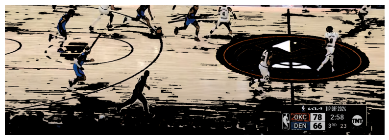

# Court-Based Player and Ball Tracking using Computer Vision

## Introduction
For this project checkpoint I tried to implement the calculation of court dominance. This is done by identifying specific jersey colors while also tracking the position of the ball so we can estimate the direction of play and account for that in the calculation of court dominance. This was a bit difficult to implement due to the dynamic nature of the game.

## Methodology

For this project I am using a combination of YOLO and color detection on the image. I am using color detection to try and detect the jerseys of each of the players on the court. Using the detected colors we can split the players into teams. Using the cooridantes of the detected colors I am able to calculate the positions of the dominance of the court.

For this I have defined a metric of court dominance, which is a way to quantify which side of the court holds more player presence or control. I also am using the coordinates of the ball in this calculation so we can estimate the direction of flow of the players, for example if the majority of bodies are on the right half of the screen and the ball is in the hands of a player on the left side, we can asume that both teams are running towards the right side.

The X-coordinates of the players and the ball are averaged to determine said overall court dominance score. The range of values for this are between -1 and 1 inclusively, with -1 indicating high left side dominance, and +1 indicating high right side dominance. Consequently, 0 would indicate neutral or no dominance.

# Results

### Original Image

### Processed Image

`Court Dominance: 0.17`

As we can see from the results, the algorithm is working but there is still room for improvement, the this position is pretty neutral as they are running towards the opposite end of the court, but there are still room for improvements. I think the image could be filtered a bit better so the scoreboard is not detected, and i think a better aggregation can be used for the court dominance calculation rather than the positional average.