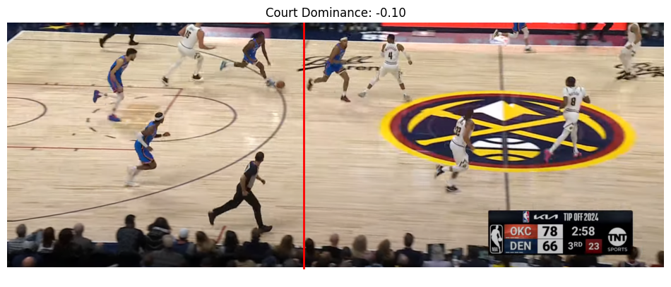

# NBA Winning Prediction Model
## Presented by: Nicholas Kissoon 

### Please note that the final and relevant files are as follows, the rest were just checkpoints or temp/working files. Please pay attention to: README.md, NBA ML Model.pdf, cv.ipynb, MLPClassifier.ipynb, nlp.ipynb and all the respective .png files.

## Inspiration

Sports are a vast source of complex data and statistics and something I find myself watching quite often, which led to the passion behind this project. Due to the high scoring and unpredictability of the NBA, I have devised an idea to analyze this further to gain a better and deeper understanding of not only the sport but the statistics that make it. This model will be able to predict winning teams of an NBA match. I was inspired by Professor Pu’s famous words, paraphrased of course,  how can one make something profitable, or at the very least good for your resume. While also creating a useful tool that I could see myself using for years to come

## Data Collection and Models

Data collection for the project will be from various sports websites but mainly that of NBA.com (the official league website) for the official stats of the players and teams. I will be using the nba_api in order to collect data and  I will be utilizing a classifier approach for the machine learning model. I ended up choosing to use a multilayer perceptron as my model. This was the eventually selected approach due to the importance of feature selection and how it handles non-linear relationships within the data. As mentioned in my proposal feature selection plays a very large role, however the ability to handle complex, nonlinear is key here as that helps with variables such as player performance, team dynamics and historical data/statistics.

## Computer Vision (CV)

I tried to implement the calculation of court dominance. This is done by identifying specific jersey colors while also tracking the position of the ball so we can estimate the direction of play and account for that in the calculation of court dominance. This was a bit difficult to implement due to the dynamic nature of the game.

## Methodology

For this project I am using a combination of YOLO and color detection on the image. I am using color detection to try and detect the jerseys of each of the players on the court. Using the detected colors we can split the players into teams. Using the cooridantes of the detected colors I am able to calculate the positions of the dominance of the court.

For this I have defined a metric of court dominance, which is a way to quantify which side of the court holds more player presence or control. I also am using the coordinates of the ball in this calculation so we can estimate the direction of flow of the players, for example if the majority of bodies are on the right half of the screen and the ball is in the hands of a player on the left side, we can asume that both teams are running towards the right side.

The X-coordinates of the players and the ball are averaged to determine said overall court dominance score. The range of values for this are between -1 and 1 inclusively, with -1 indicating high left side dominance, and +1 indicating high right side dominance. Consequently, 0 would indicate neutral or no dominance.

# Results

### Original Image

### Processed Image

`Court Dominance: -0.10`

As we can see from the results, the algorithm is working but there is still room for improvement, the this position is pretty neutral as they are running towards the opposite end of the court, but there are still room for improvements.

## Natural Language Processing (NLP)

This is for the NLP portion of the project. I have implemented a chatbot that is able to take queries and answer them to the best of their ability. It is in it's early testing however the ambition here is to get it to respond to not only user queries. GPT2 was used in order to achieve this. Taking any recommendations you have for this model. It is a simple model right now that is handling question/answer sessions under certain conditions, such as a resticted input length. The aim is to make some of these restrictions less intrusive, to truly allow users to effortlessly communicate and ask away their questions, while getting efficient and meaningful advice or help.

### Results

#### Input
How many people are on a basket ball team?

#### Output
It's hard to say. The average player is averaging around 20 points per game. So if you look at the NBA, it's very different. You're going to have a bunch of guys that are playing a lot more minutes, but it's a different league.

So when you look at the average NBA team, it's not that you're going to have a lot of players who are on a basket ball team, but

#### Takeaways
As you can see here there is still quite some work to do, however in fairness it did bring up a valid point that I more often that not overlook. That is, the NBA is not the only professional league and so the answer to this question isn't as straightforward as one may think. It does work however and it is somewhat on topic, I tried to refine and train this in many ways with two different datasets to no avail.

## Conclusion

- We examined how this model can return viable information for bettors and sports analysts alike through the use of machine learning classification (Multi-layer Perceptron [MLP]), computer vision (CV) and natural language processing (NLP)
- Our classifier achieved an accuracy rate of 0.82, ranking the important features and even predicted scores for a new season.
- We were able to calculate the court dominance using cv which can help provide insight to those betting as well as the visually challenged so long as this prompt is said allowed to them
- While doing its best to stay relevant and on topic we see here how GPT2 can answer some of the users questions to bring an element of nlp to the project.
- I thank you for taking the time to explore this project, feel free to clone the Github repository (https://github.com/Kxssoon/CSCI4052Project) and play around with it yourself to see how you can make it further beneficial for you.
- Stay Ballin.